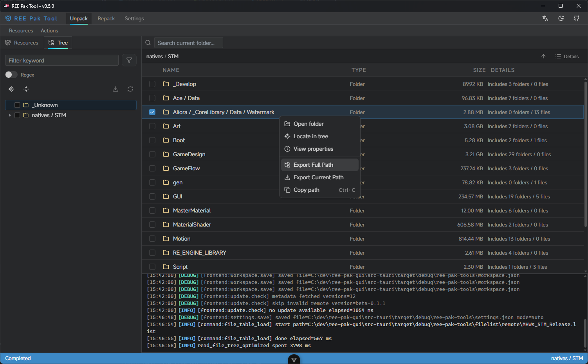
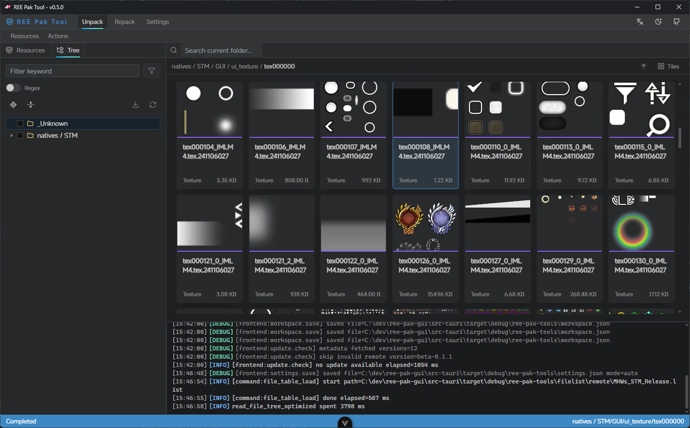
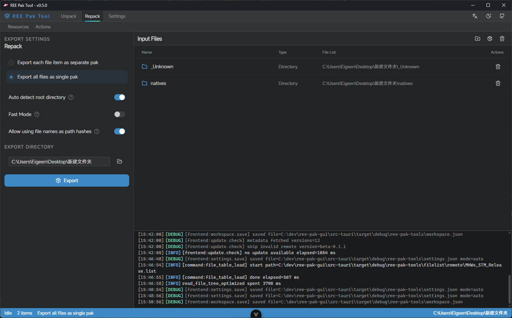

# REE Pak Tool (GUI Application)

## Donwload

https://github.com/eigeen/ree-pak-gui/releases

## Introduction

Added more **right-click** menus in v0.5.0 and later. Try right-clicking for more interactions!





## User Manual

In progress.

## Changelog

[CHANGELOG](CHANGELOG.md)

## Building

```sh
bun install
bun tauri build
```

## Credits

- [Ekey/REE.PAK.Tool](https://github.com/Ekey/REE.PAK.Tool) - The original algorithm of PAK file format by Ekey.
- [bnnm/wwiser](https://github.com/bnnm/wwiser) - Wwise Bank file format specification.
- [AsteriskAmpersand/MHWs_Tex_Chopper](https://github.com/AsteriskAmpersand/MHWs_Tex_Chopper) - Texture file format specification.
- [kagenocookie/REE-Content-Editor](https://github.com/kagenocookie/REE-Content-Editor) - For more format specifications.
